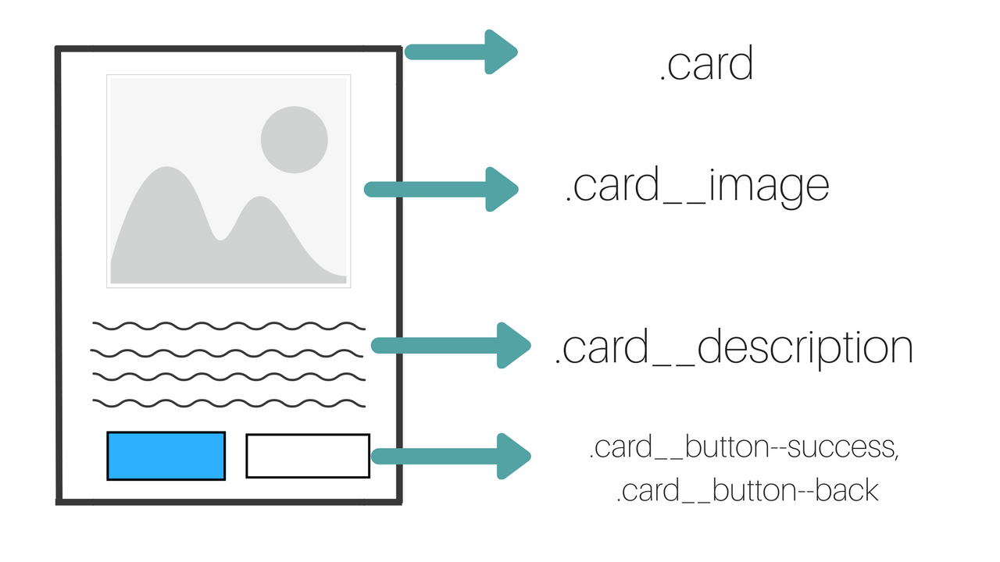
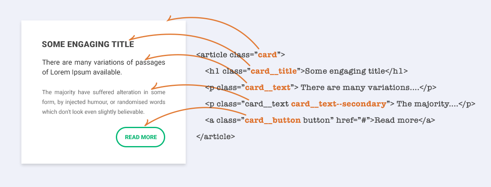

# METODOLOGÍAS CSS
Sistemas preestablecidos, formales y bien documentados que te ayudan a escribir, organizar código mantenible y escalable

## BEM (Bloque, Elemento, Modificador)



### Bloque
Son nuestros contenedores más grandes que a su vez contienen elementos u otros bloques.

### Elementos
Forman parte de un bloque, normalmente son los botones, textos, imágenes etc.

### Modificadores
Se usan para establecer estilos diferentes a un mismo bloque o elemento.

  

```
[bloque]__[elemento]
[bloque]--[modificador]
[elemento]--[modificador]
[bloque]__[elemento]--[modificador]
```
