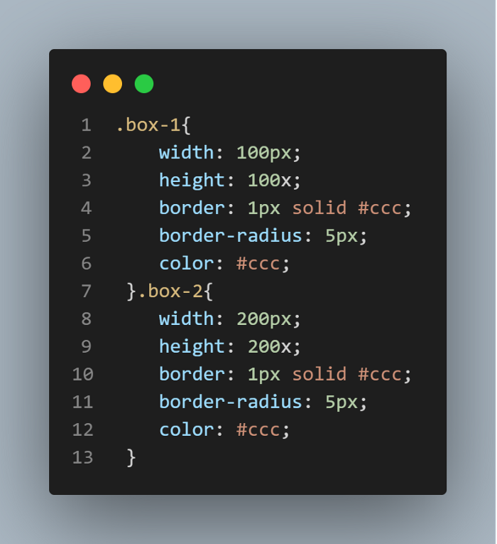
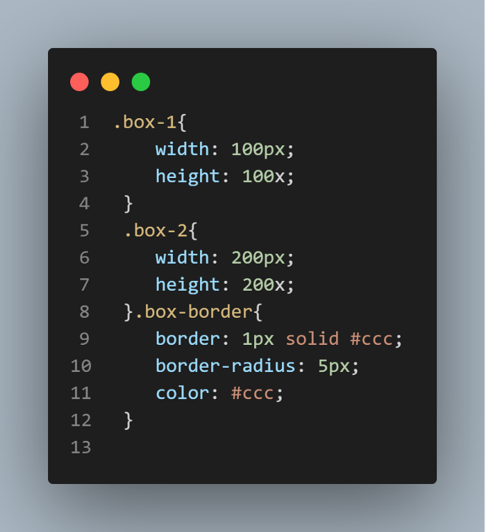
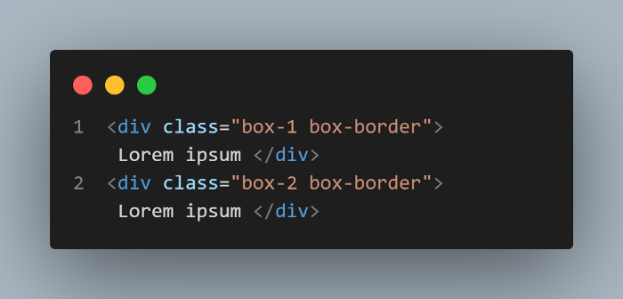

# METODOLOGÍAS CSS
Sistemas preestablecidos, formales y bien documentados que te ayudan a escribir, organizar código mantenible y escalable.

## OOCSS (Object-Oriented CSS)
Hojas de estilo en cascada orientadas a objetos, se preocupa por la conversión de sus estilos CSS normales a clases reutilizables.

### Estructura y piel separadas
La estructura se refiere a estilos invisibles aplicados a elementos (ancho, altura, margen, relleno), mientras que la piel es los estilos visibles (colores, fuentes, sombras).

 

Los archivos de estructura y diseño son archivos separados. Estructura significa: "ancho, alto, relleno, margen, posición". Diseño significa: "borde, color, fuente, fondo". Los archivos de diseño y los archivos de estructura deben estar separados.

#### Incorrecto

#### Correcto  

#### HTML

 

Este principio sugiere que los child-sellectors deben usarse menos.  

Si el elemento `<h2>` se usa en más de un lugar en el sitio, entonces el uso de selectores secundarios viola la regla OOCSS y conduce a la duplicación del código.
